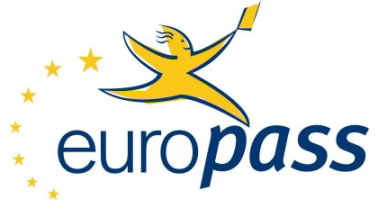

<!DOCTYPE html>
<html lang="ro">
   <head>
      <link rel="stylesheet" href="stillCV.css">
      <title>Curriculum Vitae</title>
      <link rel="shortcut icon>" href="Sigla.png">
      <meta charset="UTF-8">
      
   </head>
   <body>
      
_________________________________________________________________________Curriculum Vitae

      

      <table >
         <tr>
            <td class center></td>
            <td>
               
Informații personale

               

                  Numele-Prenume:Gavrilov Sabinn 
                  Ziua de nastere: 03.12.2000 
                  Sex: Masculin 
                  Nationalitate: Română
               

               

                   România, jud Sibiu, loc Sibiu, str. Henri Coanda, nr.53, bl.4, ap.M1 
                   <a href="mailto:sabin.gavrilov@ulbsibiu.ro">sabin.gavrilov@ulbsibiu.ro</a> 
                   <a href="tel:0755123793">0755123793</a> 
                    <a href="https://www.facebook.com/c.sbin3">Facebook</a> 
                    <a href="https://www.instagram.com/c.sbin3/">Instagram</a>
               

            </td>
         </tr>
         <tr>
            <td colspan="2"> <strong>EDUCAȚIE SI FORMARE_________________________________________________________________________________________</strong></td>
         </tr>
         <tr>
            <td>
               <strong>
               Perioada 
               Diploma obținută 
               Disciplinele principale studiate 
               Profil 
               Numele instituției de invățământ
               </strong>
            </td>
            <td>
               Septembrie 2015 - Iunie 2019 
               Diplomă de absolvire a claselor IX – XII; Certificat competenţe lingvistice – Limba Română si Engleza 
               Matematica, Informatica, Română, Biologie 
               Stiințe ale naturii 
               Colegiul Național "Gheorghe Lazar", Sibiu
            </td>
         </tr>
         <tr>
            <td>
               <strong>
               Perioada 
               Diploma obținută 
               Furnizorul de formare
               </strong>
            </td>
            <td>
               Septembrie 2016 - Iunie 2018 
               ECDL PROFILE CERTIFICATE 
               ECDL Romania	
            </td>
         </tr>
         <tr>
            <td>
               <strong>
               Perioada 
               Numele instituției de invățământ 
               Specializarea
               </strong>
            </td>
            <td>
               Septembrie 2019 - Prezent 
               Facultatea de inginerie a ULBS 
               Calculatoare
            </td>
         </tr>
         <tr>
            <td colspan="2"> <strong>APTITUDINI SI COMPETENȚE PERSONALE _________________________________________________________________________</strong></td>
         </tr>
         <tr>
            <td><strong>Limba materna </strong></td>
            <td>Română</td>
         </tr>
         <tr>
            <td class bauriba><strong>Limbi straine: </strong></td>
            <td class bauriba></td>
         </tr>
         <tr>
            <td><strong>Engleză</strong></td>
            <td class bauriba>
               <table>
                  <tr>
                     <td colspan="2">ÎNȚELEGERE</td>
                     <td colspan="2">VORBIRE</td>
                     <td>SCRIERE</td>
                  </tr>
                  <tr>
                     <td>Ascultare</td>
                     <td>Citire</td>
                     <td>Participare la conversație</td>
                     <td>Discurs Oral</td>
                     <td>Exprimare scrisă</td>
                  </tr>
                  <tr>
                     <td>B1</td>
                     <td>B2</td>
                     <td>B2</td>
                     <td>B2</td>
                     <td>B2</td>
                  </tr>
               </table>
         </tr>
         <tr>
            <td class bauriba><strong>Germană</strong></td>
            <td>
               <table>
                  <tr>
                     <td colspan="2">ÎNȚELEGERE</td>
                     <td colspan="2">VORBIRE</td>
                     <td>SCRIERE</td>
                  </tr>
                  <tr>
                     <td>Ascultare</td>
                     <td>Citire</td>
                     <td>Participare la conversație</td>
                     <td>Discurs Oral</td>
                     <td>Exprimare scrisă</td>
                  </tr>
                  <tr>
                     <td>A2</td>
                     <td>A2</td>
                     <td>A2</td>
                     <td>A2</td>
                     <td>A2</td>
                  </tr>
               </table>
         </tr>
         <tr>
            <td><strong>Competenţe şi abilităţi sociale</strong></td>
            <td>Aspectele care mă caracterizează sunt munca in echipă, comunicativitatea, seriozitatea și organizarea </td>
         </tr>
         <tr>
            <td><strong>Competenţe şi aptitudini de utilizare a calculatorului</strong></td>
            <td>
               O bună stăpânire a limbajului C++, precum și a principiilor de programare orientată pe obiecte 
               Capacitatea de a utiliza suita “Microsoft Office” 
               Aptitudini de baza in “Photoshop” 
            </td>
         </tr>
         <tr>
            <td><strong>Pasiuni și competențe artistice</strong></td>
            <td> Sport, calatorii, muzica </td>
         </tr>
         <tr>
            <td><strong>Permis de conducere</strong></td>
            <td> Categoria B </td>
         </tr>
      </table>
      

      
<a href="http://csac.ulbsibiu.ro/">Departament of Computer Science</a>
      

   </body>
</html>